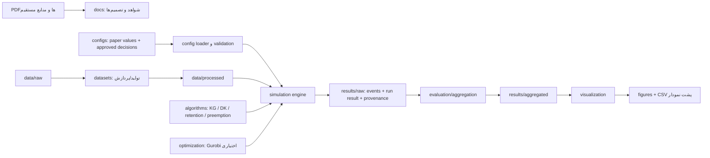

# مرحله ششم: طراحی معماری پروژه

## 1. دامنه، وضعیت فعلی و قرارداد شواهد

- منبع پژوهشی مبنا: *Improved Methods of Task Assignment and Resource Allocation with Preemption in Edge Computing Systems*، نسخه `arXiv:2403.15665v2` مورخ 29 مارس 2024.
- `[استخراج مستقیم]` معماری زیر از مدل سیستم، 31 رابطه ریاضی، الگوریتم‌ها و پروتکل آزمایش استخراج‌شده در مراحل صفر تا پنج پشتیبانی می‌کند.
- `[پیشنهاد فنی]` تمام نام پوشه‌ها، فایل‌ها، کلاس‌ها، رابط‌ها و ابزارهای مهندسی این سند پیشنهاد معماری‌اند و جزء روش مقاله نیستند.
- `[نامشخص]` مقاله زبان، نسخه Python، نسخه کتابخانه‌ها، سیستم‌عامل و ساختار کد نویسندگان را گزارش نمی‌کند.
- `[استخراج مستقیم]` بررسی workspace در 9 اوت 2026 نشان داد فقط `outputs/` و `work/` وجود دارند؛ هیچ `README.md`، `pyproject.toml`، فایل کد، فایل تنظیمات، داده خام، محیط مجازی یا مخزن Git موجود نیست.
- در این مرحله هیچ scaffold یا کد اجرایی ساخته نشده و هیچ وابستگی نصب نشده است.

## 2. اصول معماری

1. **وفاداری قابل ممیزی:** هر گزینه‌ای که بر نتیجه علمی اثر می‌گذارد باید منشأ `paper`، `direct_source`، `approved_assumption` یا `technical` داشته باشد.
2. **عدم پیش‌فرض پنهان:** هر مقدار `[نامشخص]` موردنیاز یک اجرا، پیش از آغاز اجرا خطای روشن ایجاد می‌کند؛ برنامه آن را خودکار حدس نمی‌زند.
3. **جداسازی مدل، الگوریتم و شبیه‌ساز:** مدل‌های داده از policy و solver مستقل می‌مانند تا خطای مدل با خطای الگوریتم مخلوط نشود.
4. **تراکنشی بودن تخصیص و preemption:** تغییر منابع ابتدا روی نسخه موقت اعتبارسنجی و سپس یک‌جا commit می‌شود؛ شکست، state قبلی را حفظ می‌کند.
5. **دو semantics مستقل:** batch و pipeline موتور پیشرفت جدا دارند، اما clock، event log، invariantها و policy مشترک‌اند.
6. **اتصال اختیاری Gurobi:** نبود `gurobipy` یا مجوز، الگوریتم‌های KG/DK و شبیه‌ساز را از کار نمی‌اندازد.
7. **نتیجه خام تغییرناپذیر:** هر run یک پوشه مستقل با config resolved، seed، نسخه‌ها، event log و checksum تولید می‌کند؛ تجمیع فقط از نتایج خام انجام می‌شود.
8. **RNG تزریق‌شده:** هیچ تابع علمی از RNG سراسری استفاده نمی‌کند؛ seed و generator از `RunContext` دریافت می‌شوند.
9. **واحدهای صریح:** مدل دامنه واحد canonical دارد و تبدیل MB/GB، ثانیه/slot و MFlops/s فقط در مرز ورودی انجام می‌شود.
10. **اسکریپت‌های نازک:** منطق علمی در package است و `scripts/` فقط ورودی CLI، فراخوانی و exit code را مدیریت می‌کند.

## 3. نمای جریان داده



## 4. ساختار پیشنهادی آینده

```text
edge-reproduction/
├── README.md
├── pyproject.toml
├── requirements.txt
├── uv.lock
├── .python-version
├── configs/
│   ├── schema.yaml
│   ├── unresolved_decisions.yaml
│   ├── smoke_test.yaml
│   ├── synthetic_normal.yaml
│   ├── synthetic_bimodal.yaml
│   ├── southampton.yaml
│   ├── southampton_capped.yaml
│   └── optimal_source1.yaml
├── data/
│   ├── README.md
│   ├── raw/.gitkeep
│   ├── interim/.gitkeep
│   └── processed/.gitkeep
├── docs/
│   ├── paper_notes.md
│   ├── sources.md
│   ├── traceability_matrix.md
│   ├── mathematical_model.md
│   ├── experiment_protocol.md
│   ├── assumptions.md
│   ├── data_dictionary.md
│   └── reproduction_report.md
├── src/edge_reproduction/
│   ├── __init__.py
│   ├── exceptions.py
│   ├── reproducibility.py
│   ├── models/
│   │   ├── enums.py
│   │   ├── resources.py
│   │   ├── task.py
│   │   ├── server.py
│   │   ├── bid.py
│   │   ├── allocation.py
│   │   ├── config.py
│   │   └── result.py
│   ├── algorithms/
│   │   ├── base.py
│   │   ├── auction.py
│   │   ├── pricing.py
│   │   ├── tie_breaking.py
│   │   ├── knapsack_solver.py
│   │   ├── knapsack_greedy.py
│   │   ├── double_knapsack.py
│   │   ├── retention.py
│   │   └── preemption.py
│   ├── optimization/
│   │   ├── availability.py
│   │   ├── model_builder.py
│   │   ├── gurobi_oracle.py
│   │   └── small_instance_oracle.py
│   ├── simulation/
│   │   ├── clock.py
│   │   ├── events.py
│   │   ├── state.py
│   │   ├── invariants.py
│   │   ├── batch.py
│   │   ├── pipeline.py
│   │   └── engine.py
│   ├── datasets/
│   │   ├── schema.py
│   │   ├── synthetic_normal.py
│   │   ├── synthetic_bimodal.py
│   │   └── southampton.py
│   ├── evaluation/
│   │   ├── metrics.py
│   │   ├── aggregation.py
│   │   ├── comparison.py
│   │   └── runtime.py
│   ├── visualization/
│   │   ├── style.py
│   │   ├── figures.py
│   │   └── diagnostics.py
│   └── io/
│       ├── config_loader.py
│       ├── datasets.py
│       ├── results.py
│       └── provenance.py
├── scripts/
│   ├── check_environment.py
│   ├── generate_synthetic.py
│   ├── preprocess_southampton.py
│   ├── run_experiment.py
│   ├── run_all_experiments.py
│   ├── aggregate_results.py
│   ├── reproduce_figures.py
│   └── reproduce_all.py
├── tests/
│   ├── fixtures/
│   ├── unit/
│   ├── integration/
│   └── regression/
├── results/
│   ├── raw/.gitkeep
│   ├── aggregated/.gitkeep
│   ├── logs/.gitkeep
│   └── metadata/.gitkeep
└── figures/.gitkeep
```

این درخت در مرحله ششم **ایجاد نشده است**. ایجاد مرحله‌ای آن پس از تأیید معماری انجام خواهد شد.

## 5. مسئولیت فایل‌های سطح ریشه و تنظیمات

| مسیر آینده | مسئولیت | ارتباط با مقاله | ورودی | خروجی | آزمون آینده |
| --- | --- | --- | --- | --- | --- |
| `README.md` | راهنمای نصب، اجرا و محدوده وفاداری | کل مقاله و مراحل 0-18 | اسناد و CLI نهایی | دستورهای قابل اجرا | اجرای دستورات در محیط پاک |
| `pyproject.toml` | منبع اصلی metadata، dependencies و تنظیم pytest/ruff/mypy | `[پیشنهاد فنی]` | نسخه‌های مصوب | package قابل نصب | build و نصب editable |
| `requirements.txt` | export قفل‌شده برای کاربران `pip`؛ منبع دوم تصمیم نیست | `[پیشنهاد فنی]` | lock | فهرست دقیق با hash در نسخه نهایی | نصب در محیط پاک |
| `uv.lock` | قفل transitive و چندسکویی | `[پیشنهاد فنی]` | `pyproject.toml` | dependency graph دقیق | `uv lock --check` |
| `.python-version` | ثبت Python `3.12.13` هدف | `[پیشنهاد فنی]`؛ نسخه مقاله `[نامشخص]` | انتخاب فنی | نسخه runtime | تطبیق environment check |
| `configs/schema.yaml` | تعریف نام، نوع، واحد، required بودن و provenance هر config key | روابط (1)-(31)، Tables I-II | قرارداد استخراج‌شده | اعتبارسنجی config | config معتبر/نامعتبر |
| `configs/unresolved_decisions.yaml` | فهرست تصمیم‌های حل‌نشده با `status: pending`؛ محل مقدار اجرایی نیست | ابهام‌های مراحل 3-5 | شناسه ابهام و گزینه‌ها | gate اجرای وفادار | pending decision باید fail کند |
| `configs/smoke_test.yaml` | نمونه کوچک 2 سرور/3-5 task پس از تصویب مفروضات | مرحله نهم، نه آزمایش مقاله | مقادیر دستی | اجرای سریع | محاسبه دستی در برابر برنامه |
| `configs/synthetic_normal.yaml` | Table I و sweepهای Figs. 6-12 | Section VI-A/B1 | پارامترهای گزارش‌شده + تصمیم‌های مصوب | config resolved | schema و provenance |
| `configs/synthetic_bimodal.yaml` | Table II و Figs. 13-15 | Section VI-B2 | mixture و server params | config resolved | نسبت 90/10 و schema |
| `configs/southampton.yaml` | trace پایه و Fig. 19 | Section VI-B3 | مسیر raw، window و mapping مصوب | config پردازش/اجرا | عدم تغییر raw و شمارش رکورد |
| `configs/southampton_capped.yaml` | deadline حداکثر 12 slot و Fig. 20 | Section VI-B3 | config پایه | variant resolved | فقط deadline تغییر کند |
| `configs/optimal_source1.yaml` | نمونه‌های 25/18/10-job و oracle | Section VI-A1 و منبع [1] | instance یا generator مصوب | config exact | provenance بین v2 و [1] |

## 6. مسئولیت داده و اسناد

| مسیر آینده | مسئولیت | ارتباط با مقاله | ورودی | خروجی | آزمون آینده |
| --- | --- | --- | --- | --- | --- |
| `data/README.md` | سیاست data lineage، مجوز و checksum | trace Southampton و synthetic | metadata | راهنمای داده | وجود checksum/schema |
| `data/raw/` | داده دریافت‌شده، فقط‌خواندنی از دید pipeline | Southampton raw | فایل اصلی | همان فایل بدون mutation | SHA-256 قبل/بعد |
| `data/interim/` | خروجی‌های میانی قابل حذف و بازسازی | پاک‌سازی trace | raw | داده مرحله‌ای + audit counts | شمارش هر تبدیل |
| `data/processed/` | dataset canonical مصرف شبیه‌ساز | synthetic/trace | interim یا generator | CSV/Parquet نهایی | schema، unit، checksum |
| `docs/paper_notes.md` | ادعاها با صفحه و برچسب شاهد | کل v2 | اسناد مراحل گذشته | یادداشت مرجع | بازبینی ارجاع صفحه |
| `docs/sources.md` | هویت، DOI و hash مقاله و منابع [1]/[4] | ممیزی منابع | PDFها | manifest منبع | hash regression |
| `docs/traceability_matrix.md` | مقاله → کد → آزمون → نتیجه | کل پروژه | ماتریس فعلی | سند زنده | همه شناسه‌ها مقصد/آزمون داشته باشند |
| `docs/mathematical_model.md` | 31 رابطه، ناسازگاری و تصمیم تفسیر | Section IV | مرحله سوم | specification اجرایی | تطبیق شماره رابطه |
| `docs/experiment_protocol.md` | پارامترها و target شکل/جدول | Section VI | مرحله پنجم | protocol registry | پوشش Figs. 1-20/Tables I-II |
| `docs/assumptions.md` | فقط تصمیم‌های تأییدشده با تاریخ و اثر | کمبودهای مقاله | تأیید کاربر | assumption ledger | هیچ config مؤثر بدون entry |
| `docs/data_dictionary.md` | ستون، نوع، واحد، منشأ و تبدیل | Tables I-II و trace | schemaها | data dictionary | تطبیق با processed data |
| `docs/reproduction_report.md` | گزارش نهایی اختلاف و fidelity | مرحله هجدهم | نتایج واقعی | گزارش علمی | لینک هر ادعا به artifact |

## 7. مسئولیت هسته Python

### 7.1 package و مدل‌ها

| مسیر آینده | مسئولیت | ارتباط با مقاله | ورودی/خروجی | آزمون آینده |
| --- | --- | --- | --- | --- |
| `__init__.py` | نسخه package و API عمومی حداقلی | `[پیشنهاد فنی]` | metadata → version | import smoke |
| `exceptions.py` | خطاهای typed مانند `UnresolvedDecisionError` و `GurobiUnavailableError` | اجرای شفاف ابهام‌ها | وضعیت نامعتبر → خطای روشن | پیام و نوع خطا |
| `reproducibility.py` | seed sequence، RNGهای نام‌گذاری‌شده و fingerprint run | seed مقاله `[نامشخص]` | master seed → generators/manifest | replay byte-stable |
| `models/enums.py` | `TaskState`، `EventType`، `ProcessingMode` | lifecycle مرحله دوم | رشته config ↔ enum | transition invalid |
| `models/resources.py` | بردار storage/compute/upload/download و arithmetic مؤلفه‌ای | قیود ظرفیت (2)-(6)، (14)-(18) | vectors → fit/residual | صفر، منفی، overflow |
| `models/task.py` | پارامترها و progress/state task | Section IV و Table I | task record → validated object | واحد، deadline، state |
| `models/server.py` | ظرفیت کل/آزاد و allocationهای server | مجموعه `I` و قیود ظرفیت | capacity + allocations → residual | ناوردای ظرفیت |
| `models/bid.py` | bid، price kind و round | دو دور مزایده، Algorithm 1 | task/server/price → Bid | قیمت finite/sentinel |
| `models/allocation.py` | تخصیص و transaction تغییر منابع | متغیرهای `x`,`y`,`z` و preemption | proposal → commit/rollback | atomicity |
| `models/config.py` | dataclassهای typed برای experiment و solver | Section VI | YAML resolved → config | missing/extra/type/unit |
| `models/result.py` | schema نتیجه run و statusها | معیارهای Figs. 6-20 | events/config → result | serialization round-trip |

### 7.2 الگوریتم‌ها

| مسیر آینده | مسئولیت | ارتباط با مقاله | ورودی/خروجی | آزمون آینده |
| --- | --- | --- | --- | --- |
| `algorithms/base.py` | `AllocationPolicy` protocol مشترک | مقایسه منصفانه KG/DK | state+jobs+RNG → decisions | contract test همه policyها |
| `algorithms/auction.py` | orchestration Round 1/انتخاب client/Round 2 | Section III | requests → bids → returns → decisions | ترتیب دو دور |
| `algorithms/pricing.py` | fit، preemption و impossible pricing | Algorithm 1 | state/job/sets → price | مثال‌های مرحله 4؛ unresolved gate |
| `algorithms/tie_breaking.py` | تنها محل سیاست تساوی، قابل ثبت در config | tie rule `[نامشخص]` | candidates+RNG → one/order | replay با seed |
| `algorithms/knapsack_solver.py` | adapter باریک برای `pyeasyga` و ثبت پارامترهای GA | Section V-A3 | items/capacity/GA config → membership | fixed-seed و feasibility |
| `algorithms/knapsack_greedy.py` | Algorithm 1 و ترتیب greedy Round 2 | Section V-A | bids/state → allocation plan | خط‌به‌خط Algorithm 1/2 |
| `algorithms/double_knapsack.py` | DK Round 1/2 و score عضویت | Section V-B و منبع [1] | candidates → plan | score و unresolved steps |
| `algorithms/retention.py` | variant بدون حذف running task | KG-R/DK-R | plan/state → retained plan | هیچ preemption رخ ندهد |
| `algorithms/preemption.py` | victim selection و transactional replacement | KG-P/DK-P | incoming/current → transaction | یک/چند victim، rollback |

`[نامشخص]` فایل‌های algorithm تا زمان تصویب تصمیم‌های مرحله چهارم نباید implementation نهایی وانمودشده داشته باشند. معماری اجازه می‌دهد هر تصمیم حل‌نشده با شناسه در config gate شود.

### 7.3 بهینه‌سازی

| مسیر آینده | مسئولیت | ارتباط با مقاله | ورودی/خروجی | آزمون آینده |
| --- | --- | --- | --- | --- |
| `optimization/availability.py` | import تنبل، تشخیص نصب و مجوز؛ بدون توقف package | Gurobi در Section VI-A1 | environment → capability report | محیط بدون gurobipy |
| `optimization/model_builder.py` | ساخت solver-neutral داده روابط (1)-(31) پس از رفع ناسازگاری | Section IV | instance/config → model data | هر قید مثبت/منفی |
| `optimization/gurobi_oracle.py` | تبدیل model data به `gurobipy.Model` و ثبت status/bound/gap | oracle مقاله | model data → exact result | tiny licensed model؛ skip مستند بدون مجوز |
| `optimization/small_instance_oracle.py` | `[ابزار کمکی]` enumerator برای نمونه‌های بسیار کوچک و آزمون model builder؛ جایگزین رسمی Gurobi نیست | آزمون فنی | tiny instance → optimum | تطبیق با شمارش دستی |

### 7.4 شبیه‌ساز

| مسیر آینده | مسئولیت | ارتباط با مقاله | ورودی/خروجی | آزمون آینده |
| --- | --- | --- | --- | --- |
| `simulation/clock.py` | slot/epoch و ordering رویداد هم‌زمان | Figs. 1-2 و deadlines | time/events → next time | off-by-one و tie time |
| `simulation/events.py` | event immutable شامل before/after/reason/price/utility | نیاز audit علمی | state transition → event row | schema و ترتیب پایدار |
| `simulation/state.py` | registry task/server/bid/allocation و snapshot | مدل سیستم | initial data → `SimulationState` | clone و consistency |
| `simulation/invariants.py` | ظرفیت، تک‌سروری، state/resource و no rerun | قیود مدل | state → pass/violation | هر invariant مثبت/منفی |
| `simulation/batch.py` | upload سپس compute سپس download بدون هم‌پوشانی | Section III/IV | allocation+slot → progress | سه فاز و deadline |
| `simulation/pipeline.py` | پیشرفت هم‌زمان متناسب طبق (9)-(10) | Section IV | allocation+slot → progress | proportionality |
| `simulation/engine.py` | event loop: arrival، auction، execution، completion/expiry | گردش کامل سیستم | config+dataset+policy → events/result | سناریوی دستی و determinism |

### 7.5 dataset، evaluation، visualization و I/O

| مسیر آینده | مسئولیت | ارتباط با مقاله | ورودی/خروجی | آزمون آینده |
| --- | --- | --- | --- | --- |
| `datasets/schema.py` | schema canonical task/server/trace | Tables I-II | rows → validated rows | unit/type/null |
| `datasets/synthetic_normal.py` | مولد Normal پس از تصویب rounding/truncation | Table I | config+RNG → dataset | moment/positivity/replay |
| `datasets/synthetic_bimodal.py` | مولد 90/10 Bimodal | Table II | config+RNG → dataset | mixture ratio/classes |
| `datasets/southampton.py` | ingest/filter/map trace بدون تغییر raw | Section VI-B3 | raw+mapping → interim/processed | counts و checksum |
| `evaluation/metrics.py` | Utility/count completed/rejected/ever-preempted | Figs. 6-20 | events → metrics | overlap و no double count |
| `evaluation/aggregation.py` | group runها؛ روش aggregation فقط از config مصوب | Section VI `[نامشخص]` | raw results → tables | recompute و seed coverage |
| `evaluation/comparison.py` | اختلاف مطلق/نسبی و سطح fidelity | مراحل 14-15 | paper estimates+results → comparison | edge cases صفر |
| `evaluation/runtime.py` | wall/process time و solver timing metadata | runtimeهای Section VI | timers → records | monotonic timer |
| `visualization/style.py` | palette/labels/units ثابت و جدا از داده | شکل‌های مقاله | style spec → kwargs | snapshot metadata |
| `visualization/figures.py` | Figs. 1-20 از aggregated CSV | Section VI | CSV → PNG+SVG/PDF | فایل و محور/series |
| `visualization/diagnostics.py` | `[آزمون کمکی]` توزیع و sanity plots | مرحله 11 | dataset → diagnostics | deterministic figure data |
| `io/config_loader.py` | load، schema validation، merge و provenance | همه configها | YAML → frozen config | unresolved/override errors |
| `io/datasets.py` | CSV/Parquet I/O و checksum | pipeline داده | rows/files ↔ data | round-trip |
| `io/results.py` | نوشتن اتمیک raw/aggregated | خروجی آزمایش | records → artifacts | interrupted write |
| `io/provenance.py` | Python/package/OS/CPU/config/source hashes | کمبود محیط مقاله | environment → manifest JSON | required fields و no secrets |

## 8. مسئولیت اسکریپت‌ها، آزمون‌ها و خروجی‌ها

| مسیر آینده | مسئولیت | ورودی | خروجی | آزمون آینده |
| --- | --- | --- | --- | --- |
| `scripts/check_environment.py` | بررسی Python، packageها، paths و قابلیت Gurobi | environment | report + exit code | محیط core و optional |
| `scripts/generate_synthetic.py` | CLI مولد Normal/Bimodal | config/seed | processed dataset+manifest | اجرای دوباره یکسان |
| `scripts/preprocess_southampton.py` | CLI تبدیل trace | raw/config | interim/processed+audit | fixture کوچک |
| `scripts/run_experiment.py` | اجرای یک config/seed/method | config | raw run directory | smoke CLI |
| `scripts/run_all_experiments.py` | matrix روش×seed×experiment؛ resume-safe | registry | چند raw run | resume بدون overwrite |
| `scripts/aggregate_results.py` | محاسبه tables از raw | raw roots | aggregated CSV | پاک‌سازی و بازتولید |
| `scripts/reproduce_figures.py` | تولید شکل‌ها و data-behind-plot | aggregated CSV | PNG+SVG/PDF+CSV | همه targetها |
| `scripts/reproduce_all.py` | check→data→tests→runs→aggregate→figures→report | root config | pipeline کامل | محیط پاک، ابتدا smoke |
| `tests/fixtures/` | نمونه‌های دستی/کوچک versioned | specifications | reusable fixtures | checksum fixture |
| `tests/unit/` | فرمول، کلاس، transition، pricing، metric | اجزای منفرد | pass/fail | حداقل مثبت و منفی هر قید |
| `tests/integration/` | auction+engine+dataset+I/O | scenario | event/result | سناریوی مرحله نهم |
| `tests/regression/` | seed و خروجی‌های کوچک قفل‌شده | approved baselines | comparisons | عدم drift پنهان |
| `results/raw/` | runهای مستقل append-only | اجرای واقعی | events/config/result | manifest completeness |
| `results/aggregated/` | فقط خروجی اسکریپت aggregation | raw | CSV summary | lineage به run IDs |
| `results/logs/` | log ماشین‌خوان و انسانی | pipeline | JSONL/text | timestamps/reasons |
| `results/metadata/` | environment و source manifests | run/tooling | JSON | hash validation |
| `figures/` | نمودار نهایی و CSV پشت آن | aggregated | PNG+SVG/PDF+CSV | rebuild و نام target |

## 9. قراردادهای اجرایی کلیدی

### 9.1 رابط policy

`[پیشنهاد فنی]` همه روش‌ها باید رابط مفهومی یکسان داشته باشند:

```text
AllocationPolicy.quote_round_one(server_snapshot, arriving_tasks, context) -> BidSet
AllocationPolicy.allocate_round_two(server_snapshot, returning_tasks, context) -> AllocationPlan
```

`AllocationPlan` فقط proposal است؛ `SimulationState` پس از بررسی invariantها آن را commit می‌کند. به این ترتیب KG، DK، Retention و Preemption نمی‌توانند state را خارج از کنترل موتور تغییر دهند.

### 9.2 ثبت تصمیم حل‌نشده

هر کلید حساس باید چهار فیلد داشته باشد:

```yaml
value: null
provenance: unknown
decision_id: DEC-DEADLINE-BOUNDARY
status: pending
```

فقط پس از تأیید کاربر، `value` مقدار می‌گیرد، `provenance: approved_assumption` می‌شود و همان تصمیم در `docs/assumptions.md` ثبت می‌گردد. این قالب `[پیشنهاد فنی]` است؛ هیچ `[فرض بازتولید]` در این مرحله اعمال نشده است.

### 9.3 قرارداد event log

حداقل ستون‌ها: `run_id`, `sequence`, `slot`, `epoch`, `event_type`, `task_id`, `server_id`, `task_state_before`, `task_state_after`, چهار مؤلفه منابع قبل/بعد، `price`, `utility`, `reason_code`, `policy`, `seed`. این schema هم debugging و هم محاسبه مستقل metricها را ممکن می‌کند.

## 10. انتخاب Python و وابستگی‌ها

مقاله هیچ نسخه‌ای گزارش نکرده است؛ بنابراین همه انتخاب‌های این بخش `[پیشنهاد فنی]` هستند و نباید نسخه محیط مقاله نامیده شوند.

### 10.1 Python

- هدف: CPython `3.12.13` و constraint پروژه `>=3.12,<3.13`.
- دلیل: runtime بسته‌بندی‌شده workspace همین نسخه را دارد؛ Python 3.12 تا اکتبر 2028 پشتیبانی امنیتی دارد؛ و Gurobi 13.0.2 آن را پشتیبانی می‌کند.
- Python سیستم فعلی `3.14.6` است، اما برای جلوگیری از drift و ناسازگاری package قدیمی `pyeasyga` انتخاب نمی‌شود.

### 10.2 dependencyهای runtime

| package | نسخه مبنا | ضرورت | دلیل |
| --- | ---: | --- | --- |
| `numpy` | `2.5.1` | core | RNG و آرایه‌های عددی/بردار منابع |
| `pandas` | `3.0.5` | data/evaluation | trace، CSV و aggregation؛ wheel رسمی CPython 3.12 موجود است |
| `scipy` | `1.18.0` | diagnostics | آزمون‌های آماری مرحله 11؛ هسته شبیه‌ساز نباید به آن وابسته باشد |
| `matplotlib` | `3.11.1` | figures | تولید PNG و SVG/PDF |
| `PyYAML` | `6.0.3` | config | configهای YAML پیشنهادی کاربر و safe loading |
| `pyeasyga` | `0.3.1` | article-specific | `[صریح در مقاله]` نام کتابخانه آمده؛ `[نامشخص]` نسخه مقاله. این آخرین انتشار عمومی قدیمی و فقط source distribution است، پس پشت adapter محصور می‌شود |

### 10.3 dependencyهای توسعه

| package | نسخه مبنا | کاربرد |
| --- | ---: | --- |
| `pytest` | `9.1.1` | unit/integration/regression |
| `ruff` | `0.15.22` | lint و format واحد |
| `mypy` | `2.3.0` | کنترل type hintهای بخش علمی |

نسخه‌های transitive فقط پس از ساخت و اجرای compatibility smoke test در `uv.lock` قفل می‌شوند. اگر `pyeasyga 0.3.1` روی Python 3.12 ناسازگار باشد، ابتدا مشکل در adapter مستند و آزمون می‌شود؛ تغییر کتابخانه یا بازپیاده‌سازی آن بدون تأیید، مجاز نیست.

## 11. طراحی مستقل Gurobi

- `[صریح در مقاله]` Gurobi برای مدل متمرکز و محاسبه optimum/upper bound استفاده شده است.
- `[نامشخص]` نسخه Gurobi، پارامترها، MIP gap، threads، time limit، OS و سخت‌افزار مقاله گزارش نشده‌اند.
- `[پیشنهاد فنی]` extra اختیاری `gurobi` در `pyproject.toml`، در محیط امروز `gurobipy==13.0.2` را نصب می‌کند؛ این نسخه **نسخه مقاله نیست** و در manifest run ثبت می‌شود.
- نصب Python-only با `python -m pip install gurobipy==13.0.2` ممکن است و به نصب کامل Gurobi نیاز ندارد.
- بسته pip یک مجوز محدود برای مدل‌های کوچک دارد؛ حل مدل کامل ممکن است به مجوز named-user، WLS یا مجوز دانشگاهی نیاز داشته باشد.
- `gurobi_oracle.py` import را داخل مسیر اجرا انجام می‌دهد. بدون package یا license، وضعیت `SKIPPED_GUROBI_UNAVAILABLE` ثبت می‌شود و سایر روش‌ها ادامه می‌یابند.
- اطلاعات حساس مجوز، WLS secret یا token هرگز در config/result/log ذخیره نمی‌شود.
- `small_instance_oracle.py` فقط `[ابزار کمکی]` برای enumeration نمونه کوچک است و جایگزین رسمی نتایج Gurobi معرفی نمی‌شود.

منابع فنی رسمی بررسی‌شده در تاریخ 9 اوت 2026:

- Python 3.12.13: <https://www.python.org/downloads/release/python-31213/>
- نصب Gurobi Python: <https://support.gurobi.com/hc/en-us/articles/360044290292-How-do-I-install-Gurobi-for-Python>
- سازگاری نسخه‌های Python: <https://support.gurobi.com/hc/en-us/articles/360013195212-Which-Python-versions-are-supported-by-Gurobi>
- انواع مجوز: <https://support.gurobi.com/hc/en-us/articles/12684663118993-How-do-I-obtain-a-Gurobi-license>
- packageها: صفحات رسمی PyPI برای `numpy`, `pandas`, `scipy`, `matplotlib`, `PyYAML`, `pytest`, `ruff`, `mypy` و `pyeasyga`.

## 12. نگاشت معماری به مراحل بعد

| مرحله | artifact اصلی | gate ورود |
| --- | --- | --- |
| 7 | `models/*`, `config_loader`, unit tests | تأیید همین معماری |
| 8 | `resources`, `allocation`, `invariants`, `model_builder` | تصمیم درباره ناسازگاری‌های روابط |
| 9 | `simulation/*`, `smoke_test.yaml` | semantics deadline/event ordering مصوب |
| 10 | `algorithms/*`, `knapsack_solver` | تصمیم‌های Algorithm 1/2 و DK مصوب |
| 11 | synthetic generators | rounding/truncation/seed/horizon مصوب |
| 12 | Southampton processor | دریافت raw، schema و mapping مصوب |
| 13 | experiment configs/scripts | repeats/seeds/aggregation مصوب |
| 14-15 | evaluation/visualization/comparison | raw نتایج واقعی |
| 16 | test suites و clean-run | همه اجزای لازم پیاده و اجرا شده باشند |
| 17-18 | README/reproduce_all/report | آزمون نهایی موفق |

## 13. تصمیم‌های معماری و تصمیم‌های علمی

### تصمیم‌های معماری پیشنهادشده برای تأیید

1. package با layout نوع `src/` و نام `edge_reproduction`.
2. CPython 3.12.13 به‌عنوان runtime بازتولید فعلی.
3. YAML برای config و JSON/JSONL + CSV برای metadata/events/results؛ Parquet فقط در صورت نیاز حجم trace.
4. `pyproject.toml` منبع اصلی و `uv.lock` قفل دقیق؛ `requirements.txt` export سازگاری.
5. Gurobi به‌صورت optional extra و عدم شکست روش‌های دیگر در نبود آن.
6. adapter مستقل برای `pyeasyga` و عدم نشت API آن به مدل/شبیه‌ساز.
7. fail-fast برای تمام تصمیم‌های علمی `pending`.

### تصمیم‌های علمی که این مرحله عمداً نگرفته است

- مرز deadline و ترتیب eventهای هم‌زمان؛
- رفع ناسازگاری روابط (2)-(6) و پنجره‌های (22)-(27)؛
- جهت شرط 5 درصد، نبود `break` و چند-victim در Algorithm 2؛
- تعریف اجرایی congestion و impossible price؛
- جزئیات DK-R/DK-P و همه تنظیمات GA؛
- rounding/truncation/هم‌بستگی، `s'_j`، horizon، repeats و seeds؛
- تنظیمات Gurobi مقاله؛
- نگاشت Southampton.

همه این موارد `[نامشخص]` باقی می‌مانند و پیش از استفاده به تأیید کاربر نیاز دارند.

## 14. نتیجه مرحله ششم

معماری برای آغاز **ساخت مرحله‌ای هسته مدل داده** کافی است، زیرا کلاس‌های مرحله هفتم را می‌توان بدون انتخاب semantics حل‌نشده الگوریتم‌ها ساخت. با این حال، اجرای علمی مراحل 8 تا 13 همچنان به تصمیم‌های ثبت‌شده در مراحل 3 تا 5 وابسته است. در مرحله بعد باید ابتدا scaffold حداقلی و فقط کلاس‌های مستقل مدل داده ایجاد شوند؛ هیچ الگوریتم مقاله نباید زودتر پیاده‌سازی شود.
