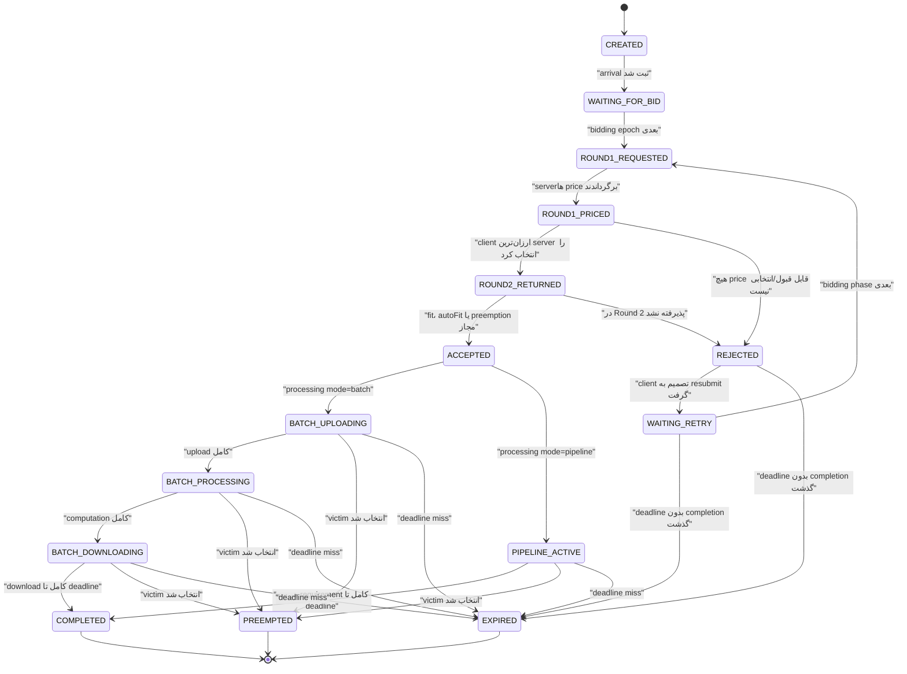

# مرحله دوم: بازسازی دقیق مدل سیستم

## 1. دامنه و منبع

- منبع یگانه استخراج: *Improved Methods of Task Assignment and Resource Allocation with Preemption in Edge Computing Systems*، نسخه `arXiv:2403.15665v2`، 29 مارس 2024.
- صفحات اصلی این مرحله: صفحه 1، Section III در صفحه 3، Section IV در صفحات 4-5، و Section V در صفحات 6-8.
- نسخه IEEE TPDS سال 2025 در این استخراج استفاده نشده است.
- هیچ `[فرض بازتولید]` در این مرحله اعمال نشده است.

## 2. مرز سیستم و هدف

`[صریح در مقاله]` سیستم برای تخصیص منابع پردازشی edge cloud به وظایفی طراحی شده است که توسط mobile clientها و از طریق لینک‌های بی‌سیم محدود ارسال می‌شوند.

`[صریح در مقاله]` هدف سیستم بیشینه‌کردن Utility کل وظایفی است که سرویس می‌گیرند. در مدل فرمول‌بندی، Utility تنها وقتی حاصل می‌شود که وظیفه تا پایان اجرا شود؛ سیاست Utility از نوع all-or-nothing است.

`[صریح در مقاله]` سیستم عملیاتی توزیع‌شده است:

- هر سرور فقط state و ظرفیت خودش را می‌شناسد.
- سرورها با یکدیگر ارتباط ندارند.
- هر سرور در Round 1 به درخواست‌ها قیمت می‌دهد و در Round 2 درباره پذیرش درخواست‌های بازگشتی تصمیم می‌گیرد.
- مشتری/وظیفه قیمت‌های سرورها را می‌بیند و یک سرور را انتخاب می‌کند.

`[صریح در مقاله]` مدل بهینه‌سازی Section IV با سیستم عملیاتی متفاوت است: مدل ریاضی یک oracle متمرکز با دانش کامل تمام سرورها، وظایف و حتی arrivalهای آینده است و فقط upper bound ایجاد می‌کند.

## 3. موجودیت‌های سیستم

| موجودیت | تعریف | اطلاعات نگه‌داری‌شده | نقش | محل | وضعیت |
| --- | --- | --- | --- | --- | --- |
| Client/User | `[صریح در مقاله]` ارسال‌کننده job request | Utility اعلامی، deadline و resource requirements | ارسال درخواست، دریافت قیمت و انتخاب سرور | صفحات 1 و 3 | در متن client و task گاهی به‌جای هم استفاده می‌شوند |
| Task/Job | `[صریح در مقاله]` واحد کار قابل تخصیص و پردازش | arrival، deadline، Utility، data/storage، computation، upload/download requirements | شرکت در مزایده و مصرف منابع | صفحات 1، 3 و 4 | job و task مترادف استفاده شده‌اند |
| Edge Server | `[صریح در مقاله]` عرضه‌کننده مستقل منابع | total/residual resources، current jobs و قیمت‌های Round 1 | قیمت‌گذاری، پذیرش، اجرا و preemption | صفحات 3، 6 و 7 | ارتباط server-to-server وجود ندارد |
| Auction/Bidding Phase | `[صریح در مقاله]` مزایده دو-round | requesting jobs، prices، marks و returning jobs | اتصال client به server | صفحه 3 | در epochهای متوالی اجرا می‌شود |
| Processing Phase | `[صریح در مقاله]` فاز اجرای job پذیرفته‌شده | progress و allocation منابع | upload، computation و download | صفحات 3-5 | batch یا pipeline |
| Central Oracle | `[صریح در مقاله]` موجودیت مفهومی مدل دقیق | تمام arrivalهای فعلی/آینده و مشخصات کل سیستم | محاسبه upper bound با MINLP | صفحات 4 و 8 | جزئی از heuristic آنلاین نیست |

## 4. مدل زمان

### 4.1 Slot و timestep

- `[صریح در مقاله]` در Section IV اصطلاح‌های `slot` و `timestep` معادل استفاده می‌شوند.
- `[صریح در مقاله]` افق زمانی محدود و شامل `N_size` slot است.
- `[صریح در مقاله]` `a_j` slot ورود job است.
- `[صریح در مقاله]` `d_j` deadline نسبی پس از arrival و بر حسب slot است.
- `[نامشخص]` مقاله مشخص نمی‌کند تکمیل دقیقاً در مرز `a_j+d_j` مجاز است یا باید پیش از آن رخ دهد؛ قیود activity window باید در مرحله سوم برای off-by-one تحلیل شوند.

### 4.2 توالی epochها

بر اساس Fig. 1 و مثال Section III:

| رخداد | epoch نسبت به arrival | برچسب |
| --- | ---: | --- |
| ورود job | `e` | `[صریح در مقاله]` |
| آغاز bidding برای همان job | `e+1` | `[صریح در مقاله]` |
| آغاز processing در صورت پذیرش | `e+2` | `[صریح در مقاله]` |

مثال خود مقاله: jobهای واردشده در epoch 2، در epoch 3 bidding و در epoch 4 processing را آغاز می‌کنند.

`[استخراج مستقیم]` در یک epoch می‌توان به‌صورت هم‌زمان arrivalهای جدید، bidding مربوط به arrivalهای قبلی و processing وظایف پذیرفته‌شده قدیمی‌تر را داشت.

`[نامشخص]` نسبت دقیق «مدت واقعی اجرای الگوریتم auction» با طول slot، جز در آزمایش accounting for auction time، به‌صورت عمومی تعریف نشده است.

## 5. ویژگی‌ها و منابع وظیفه

`[صریح در مقاله]` نیاز منابع هر وظیفه می‌تواند storage، computation، پهنای‌باند upload و پهنای‌باند download را شامل شود.

| ویژگی | نماد/نام مقاله | معنا | واحد گزارش‌شده | نقش در سیستم | وضعیت |
| --- | --- | --- | --- | --- | --- |
| Arrival time | `a_j` | زمان ورود | slot | تعیین eligibility زمانی | `[صریح در مقاله]` |
| Deadline | `d_j` | مدت مجاز پس از arrival | slot | شرط completion و ranking | `[صریح در مقاله]` |
| Utility | `U_j` / `totalUtility` | ارزش job برای user/system | بدون واحد | قیمت، ranking و objective | `[صریح در مقاله]` |
| Input/storage size | `s_j` | حجم داده/نیاز storage ورودی | MB در متن Section IV | upload و storage server | `[صریح در مقاله]` |
| Result size | `s'_j` | حجم نتیجه بازگردانده‌شده | `[نامشخص]` | download completion | `[استخراج مستقیم]` از روابط (6)-(10) |
| Computation | `K_j` | کل نیاز پردازشی | MFlops | processing progress | `[صریح در مقاله]` |
| Upload requirement | `b_{u,j}` در Table I | نیاز/نرخ upload job | MB/s | fit و تخصیص heuristic | `[صریح در مقاله]`؛ پیوند دقیق با `σ_j(n)` نامشخص |
| Download requirement | `b_{d,j}` در Table I | نیاز/نرخ download job | MB/s | fit و تخصیص heuristic | `[صریح در مقاله]`؛ پیوند دقیق با `σ'_j(n)` نامشخص |
| Time remaining | `time_remaining` | زمان باقی‌مانده job جاری | slot/time | ranking و victim selection | `[صریح در مقاله]`؛ فرمول update نامشخص |

### نکات Utility

- `[صریح در مقاله]` Utility اعلام‌شده نشان می‌دهد job چقدر می‌ارزد و مبنای قیمت پیشنهادی است.
- `[صریح در مقاله]` job کامل‌شده در deadline، Utility کامل دریافت می‌کند.
- `[صریح در مقاله]` job preempted هیچ Utility دریافت نمی‌کند.
- `[استخراج مستقیم]` jobی که تا deadline کامل نشود نیز در مدل all-or-nothing Utility صفر دارد.
- `[نامشخص]` مقاله مکانیزم پرداخت مالی واقعی یا انتقال پول پس از پذیرش را تعریف نمی‌کند؛ price عمدتاً signal انتخاب سرور است.

## 6. ویژگی‌ها و منابع سرور

| منبع | نماد | تعریف | واحد گزارش‌شده | مصرف/آزادسازی | وضعیت |
| --- | --- | --- | --- | --- | --- |
| Storage | `S_i` | ظرفیت storage کل server | GB در متن Section IV؛ MB در Table I | داده job را نگه می‌دارد | ناسازگاری واحد ثبت شد |
| Computation | `C_i` | ظرفیت computation در هر slot | MFlops/s | با `κ_j(n)` مصرف می‌شود | تبدیل rate به per-slot نامشخص |
| Upload capacity | `B_{u,i}` | ظرفیت upload server در هر slot | حاصل rate×slot duration | با `σ_j(n)` مصرف می‌شود | `[صریح در مقاله]` |
| Download capacity | `B_{d,i}` | ظرفیت download server در هر slot | حاصل rate×slot duration | با `σ'_j(n)` مصرف می‌شود | `[صریح در مقاله]` |
| Residual resources | `residual_resc`/`residual_rsc` | فضای آزاد لحظه‌ای server | بردار چندمنبعی | ورودی knapsack و fit checks | `[صریح در شبه‌کد]`؛ ساختار دقیق نامشخص |
| Current jobs | `currentJobs`/`s.jobs` | jobهای در حال اجرا | مجموعه jobها | percentile و victim selection | `[صریح در شبه‌کد]` |

### آزادسازی منابع

- `[صریح در مقاله]` در batch، هنگام ورود job به download، منابع processing آن آزاد می‌شود.
- `[صریح در مقاله]` در batch، computation و bandwidth برای یک job هم‌زمان استفاده نمی‌شوند.
- `[صریح در مقاله]` اگر task اجرا شود و results ارسال شوند، storage آن آزاد می‌شود.
- `[استخراج مستقیم]` در preemption، منابع victim باید آزاد شوند تا شرط `victim.space + residual` برای job جدید قابل استفاده باشد.
- `[نامشخص]` ترتیب اتمیک آزادسازی منابع victim و تخصیص job جدید، و آزادسازی جزءبه‌جزء bandwidth/computation در pipeline صریح نیست.

## 7. پارادایم‌های پردازش

### 7.1 Batch

`[صریح در مقاله]` مسیر batch سه فاز متمایز دارد:

1. تمام داده موردنیاز upload می‌شود.
2. سپس job پردازش می‌شود و bandwidth مصرف نمی‌کند.
3. هنگام آغاز download، منابع processing آزاد می‌شوند و results به user ارسال می‌شوند.

`[صریح در مقاله]` برای یک job، processing resources و bandwidth به‌طور هم‌زمان استفاده نمی‌شوند.

### 7.2 Pipeline

`[صریح در مقاله]` در pipeline هر سه نوع فعالیت می‌توانند هم‌زمان باشند. نمونه مقاله: وقتی 30% داده upload شده، همان بخش می‌تواند پردازش و حتی download شود، در حالی که upload ادامه دارد.

قواعد تناسب:

- `[صریح در مقاله؛ Eq. (9)]` نسبت computation تجمعی نمی‌تواند از نسبت upload تجمعی بیشتر شود.
- `[صریح در مقاله؛ Eq. (10)]` نسبت download تجمعی نمی‌تواند از نسبت computation تجمعی بیشتر شود.
- `[صریح در مقاله؛ Eq. (11)]` زمان‌های پایان میانی از ترتیب `upload ≤ processing ≤ download ≤ deadline` پیروی می‌کنند و در pipeline ممکن است دو فاز هم‌زمان تمام شوند.

## 8. جریان کامل مزایده

### 8.1 ورود و انتظار

1. `[صریح در مقاله]` job در epoch `e` وارد سیستم می‌شود و مشخصات منابع، deadline و Utility دارد.
2. `[صریح در مقاله]` bidding آن در epoch بعد آغاز می‌شود.
3. `[نامشخص]` مقاله queue، ترتیب jobهای منتظر و رفتار jobی را که پیش از bidding زمان کافی ندارد تعریف نمی‌کند.

### 8.2 Round 1: درخواست و قیمت‌گذاری

1. `[صریح در مقاله]` client درخواست خود را به تمام serverهای available ارسال می‌کند.
2. `[صریح در مقاله]` درخواست شامل resource requirements و stated Utility است.
3. `[صریح در مقاله]` هر server با توجه به residual resources، current jobs و درخواست‌های رسیده قیمت تعیین می‌کند.
4. `[صریح در مقاله]` در KnapsackGreedy، server یک knapsack روی residual resources اجرا می‌کند:
   - fit job: قیمت `0.9 × Utility` و علامت `autoFit`؛
   - non-fit ولی قابل preemption: تخفیف حداکثر 5% بر اساس percentile و congestion؛
   - job بزرگ‌تر از total capacity: قیمت بزرگ‌تر از Utility.
5. `[صریح در مقاله]` تصمیم Round 1 دائمی نیست؛ knapsack فقط پیش‌بینی می‌کند چه jobهایی احتمالاً بدون preemption جا می‌شوند.

### 8.3 انتخاب سرور توسط client

1. `[صریح در مقاله]` client ارزان‌ترین قیمت را انتخاب می‌کند.
2. `[صریح در مقاله]` سپس فقط به همان server در Round 2 درخواست processing می‌دهد.
3. `[صریح در مقاله]` price بزرگ‌تر از Utility تضمین می‌کند job به آن server بازنگردد.
4. `[استخراج مستقیم از مثال Fig. 4]` وقتی چند server قیمت fit یکسان داده‌اند، انتخاب مثال مقاله تصادفی بوده است.
5. `[نامشخص]` قاعده عمومی tie-breaking و RNG seed مشخص نیست.

### 8.4 Round 2: تصمیم نهایی سرور

برای KnapsackGreedy Preemption:

1. `[صریح در مقاله]` تمام returning jobهای دارای `autoFit` ابتدا پذیرفته می‌شوند.
2. `[صریح در مقاله]` سایر returning jobها نزولی بر اساس `Utility/time_remaining` مرتب می‌شوند.
3. `[صریح در مقاله]` current jobs صعودی بر اساس همان نسبت مرتب می‌شوند.
4. `[صریح در مقاله]` اگر returning job روی residual resources جا شود، مستقیماً پذیرفته می‌شود.
5. `[صریح در مقاله]` در غیر این صورت، server victimهای جاری را بررسی می‌کند.
6. `[صریح در مقاله]` preemption فقط وقتی مجاز است که:
   - نسبت ارزش job جدید با ضریب 1.05 حداقل به‌اندازه نسبت victim باشد؛ و
   - job جدید در `victim.space + residual_resources` جا شود.
7. `[صریح در مقاله]` در صورت احراز شرایط، victim preempt و job جدید اضافه می‌شود.
8. `[نامشخص]` شبه‌کد بعد از `Add job to server` دستور `break` ندارد؛ اضافه‌شدن تکراری یا ادامه بررسی victimها نباید بدون تصمیم بازتولید پیاده‌سازی شود.

برای Retention:

- `[صریح در مقاله]` Round 1 همان نسخه preemptive است.
- `[استخراج مستقیم]` در Round 2 هیچ current job نباید برای پذیرش job جدید متوقف شود.
- `[نامشخص]` شبه‌کد کامل Round 2 Retention در v2 ارائه نشده و به روش‌های پیشین وابسته است.

### 8.5 آغاز پردازش

- `[صریح در مقاله]` وقتی bidding یک مجموعه job تمام شد، processing jobهای پذیرفته‌شده آغاز می‌شود.
- `[صریح در مقاله]` heuristic یک minimum allocation در هر timestep برای تضمین completion هنگام پذیرش در نظر می‌گیرد.
- `[نامشخص]` فرمول دقیق minimum resource allocation در v2 ارائه نشده است.

## 9. مسیرهای نهایی یک وظیفه

### 9.1 پذیرش و تکمیل

1. arrival و انتظار تا bidding؛
2. ارسال درخواست Round 1 به همه serverها؛
3. دریافت قیمت و انتخاب ارزان‌ترین server؛
4. بازگشت در Round 2؛
5. پذیرش مستقیم، autoFit یا پذیرش با preemption victim؛
6. آغاز batch یا pipeline processing؛
7. completion تمام upload، computation و download تا deadline؛
8. دریافت Utility کامل و آزادسازی منابع.

همه مراحل بالا `[صریح در مقاله]` هستند، جز نام‌های state که در بخش 10 `[پیشنهاد فنی]` خواهند بود.

### 9.2 ردشدن

- `[صریح در مقاله]` job ممکن است در Round 2 «make the cut» نکند و rejected شود.
- `[صریح در مقاله]` jobی که fit نیست و هیچ victim مناسب ندارد پذیرفته نمی‌شود.
- `[نامشخص]` مقاله تفاوت میان رد موقت، رد قطعی و رد به دلیل price>Utility را به‌صورت state رسمی تعریف نمی‌کند.

### 9.3 از دست‌دادن Deadline

- `[صریح در مقاله]` Utility فقط برای jobی حاصل می‌شود که در deadline سرویس داده شود.
- `[استخراج مستقیم]` job تکمیل‌نشده تا deadline Utility صفر دارد.
- `[نامشخص]` مقاله رویداد عملیاتی مشخصی با نام `EXPIRED`، زمان حذف آن از queue/server و نحوه آزادسازی در deadline miss را تعریف نمی‌کند.

### 9.4 Preemption

- `[صریح در مقاله]` job می‌تواند در هر یک از فازهای upload، processing یا download preempt شود.
- `[صریح در مقاله]` preemption فقط پیش از completion رخ می‌دهد.
- `[صریح در مقاله]` job preempted Utility صفر دارد.
- `[صریح در مقاله]` job جدید از فضای victim به‌اضافه residual استفاده می‌کند.
- `[نامشخص]` job preempted آیا مجاز به ورود دوباره به auction است یا نه.

### 9.5 بازگشت به دور بعدی مزایده

- `[صریح در مقاله]` clientی که job آن در auction پذیرفته نشده، ممکن است آن را در bidding phase بعدی دوباره ارسال کند.
- `[نامشخص]` شرط تصمیم client برای retry، تعداد retry، به‌روزرسانی deadline و Utility و محدودیت زمان باقی‌مانده تعیین نشده است.
- هیچ رفتار retry در این سند به‌عنوان `[فرض بازتولید]` انتخاب نشده است.

## 10. مدل حالت پیشنهادی برای پیاده‌سازی آینده

خود مقاله state machine رسمی ارائه نمی‌کند. تمام نام‌های زیر `[پیشنهاد فنی]` هستند؛ شروط انتقال کنار آن‌ها با برچسب منبع مشخص می‌شوند.

### 10.1 نمودار حالت

`[پیشنهاد فنی]` در نمودار، `PREEMPTED` terminal نشان داده شده است، نه به‌عنوان ادعای مقاله؛ علت این انتخاب موقت آن است که مقاله retry برای job preempted را تعریف نکرده است. این انتخاب هنوز برای کد تصویب نشده است.

### 10.2 تعریف stateها

| State پیشنهادی | معنای اجرایی | پشتوانه مقاله | وضعیت |
| --- | --- | --- | --- |
| `CREATED` | شیء job و arrival ثبت شده | arrival صریح است | نام `[پیشنهاد فنی]` |
| `WAITING_FOR_BID` | job تا epoch بعدی منتظر bidding است | Fig. 1 | نام `[پیشنهاد فنی]` |
| `ROUND1_REQUESTED` | درخواست به serverهای available ارسال شده | Section III | نام `[پیشنهاد فنی]` |
| `ROUND1_PRICED` | قیمت‌ها دریافت شده‌اند | Section III | نام `[پیشنهاد فنی]` |
| `ROUND2_RETURNED` | client یک server را انتخاب و بازگشته است | Section III | نام `[پیشنهاد فنی]` |
| `ACCEPTED` | server منابع را برای job پذیرفته است | accepted/allocated صریح | نام `[پیشنهاد فنی]` |
| `REJECTED` | job در auction پذیرفته نشده است | rejected صریح | نام انگلیسی صریح در شکل/متن |
| `WAITING_RETRY` | client قصد resubmit دارد | resubmit ممکن است | نام و نگه‌داری `[پیشنهاد فنی]` |
| `BATCH_UPLOADING` | upload کامل batch در حال انجام است | batch upload phase صریح | نام `[پیشنهاد فنی]` |
| `BATCH_PROCESSING` | فاز computation batch | batch processing phase صریح | نام `[پیشنهاد فنی]` |
| `BATCH_DOWNLOADING` | فاز download batch | batch download phase صریح | نام `[پیشنهاد فنی]` |
| `PIPELINE_ACTIVE` | upload/compute/download ممکن است هم‌زمان فعال باشند | pipeline صریح | نام `[پیشنهاد فنی]` |
| `COMPLETED` | هر سه requirement تا deadline کامل‌اند | completion صریح | نام انگلیسی متداول در شکل‌ها |
| `PREEMPTED` | اجرای job پیش از completion متوقف شده | preemption صریح | نام صریح در مقاله |
| `EXPIRED` | deadline بدون completion گذشته است | deadline/zero utility صریح | state و نام `[پیشنهاد فنی]` |

## 11. جدول دقیق انتقال حالت

| از | به | شرط انتقال | اثر | محل مقاله | درجه اتکا |
| --- | --- | --- | --- | --- | --- |
| `CREATED` | `WAITING_FOR_BID` | job در epoch `e` وارد شود | ثبت arrival و مشخصات | Fig. 1، صفحه 3 | شرط `[صریح در مقاله]`؛ stateها پیشنهادی |
| `WAITING_FOR_BID` | `ROUND1_REQUESTED` | رسیدن bidding epoch بعدی | broadcast درخواست | صفحه 3 | `[صریح در مقاله]` |
| `ROUND1_REQUESTED` | `ROUND1_PRICED` | server درخواست را ارزیابی کند | ذخیره price/autoFit mark | صفحات 3 و 6 | `[صریح در مقاله]` |
| `ROUND1_PRICED` | `ROUND2_RETURNED` | انتخاب کمترین price توسط client | ارسال request به یک server | صفحه 3 | `[صریح در مقاله]` |
| `ROUND1_PRICED` | `REJECTED` | همه گزینه‌ها عملاً غیرقابل‌قبول باشند | job وارد Round 2 نمی‌شود | price>Utility در صفحه 6 | انتقال کلی `[استخراج مستقیم]`؛ condition کامل نامشخص |
| `ROUND2_RETURNED` | `ACCEPTED` | job autoFit باشد | تخصیص منابع | صفحه 7 | `[صریح در مقاله]` |
| `ROUND2_RETURNED` | `ACCEPTED` | job روی residual جا شود | تخصیص منابع | Algorithm 2، صفحه 7 | `[صریح در مقاله]` |
| `ROUND2_RETURNED` | `ACCEPTED` | شرط ratio 1.05 و fit-after-preemption برقرار باشد | victim متوقف، منابع آزاد، job افزوده | Algorithm 2، صفحه 7 | `[صریح در مقاله]` |
| `ROUND2_RETURNED` | `REJECTED` | هیچ مسیر پذیرش برقرار نباشد | عدم تخصیص | صفحات 3 و 7 | `[استخراج مستقیم]` |
| `REJECTED` | `WAITING_RETRY` | client تصمیم به resubmit بگیرد | انتظار دور بعد | صفحه 3 | امکان انتقال صریح؛ policy نامشخص |
| `WAITING_RETRY` | `ROUND1_REQUESTED` | bidding phase بعدی و resubmit | درخواست تازه | صفحه 3 | `[صریح در مقاله]` |
| `ACCEPTED` | processing state | bidding پایان یابد | آغاز processing | صفحه 3 | `[صریح در مقاله]` |
| `BATCH_UPLOADING` | `BATCH_PROCESSING` | تمام input data upload شود | bandwidth آزاد/compute فعال | صفحه 3 | `[صریح در مقاله]` |
| `BATCH_PROCESSING` | `BATCH_DOWNLOADING` | computation تمام شود | processing resources آزاد | صفحه 3 | `[صریح در مقاله]` |
| `BATCH_DOWNLOADING` | `COMPLETED` | تمام result data تا deadline دریافت شود | Utility کامل و آزادسازی storage | صفحات 4-5 | `[استخراج مستقیم]` از قیود |
| `PIPELINE_ACTIVE` | `COMPLETED` | upload=`s_j`، compute=`K_j` و download=`s'_j` تا deadline | Utility کامل | Eqs. (2)-(10) | `[استخراج مستقیم]` |
| active state | `PREEMPTED` | job به‌عنوان victim در Round 2 بعدی انتخاب شود | توقف، Utility صفر و واگذاری منابع | صفحات 3-5 و 7 | `[صریح در مقاله]` |
| non-completed state | `EXPIRED` | deadline بدون completion بگذرد | Utility صفر | صفحات 1 و 4-5 | پیامد `[استخراج مستقیم]`؛ event handling نامشخص |

## 12. Retention و Preemption به‌عنوان policy، نه state

`[استخراج مستقیم]` Retention و Preemption حالت چرخه عمر job نیستند؛ آن‌ها policy تصمیم‌گیری server هستند:

| Policy | رفتار با current job | رفتار با returning job | Utility current job | وضعیت اطلاعات |
| --- | --- | --- | --- | --- |
| Retention | current job به علت job جدید متوقف نمی‌شود | فقط در residual resources قابل پذیرش است | در صورت completion حفظ می‌شود | Round 2 کامل در v2 ارائه نشده |
| Preemption | current job واجد شرایط ممکن است متوقف شود | می‌تواند از victim space + residual استفاده کند | victim Utility صفر | شرط KG در Algorithm 2 موجود است |

## 13. ناورداهای قابل استخراج برای پیاده‌سازی آینده

موارد زیر `[استخراج مستقیم]` از مدل و متن‌اند:

1. یک job به حداکثر یک server تخصیص می‌یابد.
2. مجموع مصرف هر منبع در هر server/slot از ظرفیت تجاوز نمی‌کند.
3. job پیش از arrival منابع مصرف نمی‌کند.
4. processing pipeline از درصد upload جلو نمی‌زند.
5. download pipeline از درصد computation جلو نمی‌زند.
6. job preempted یا incomplete Utility دریافت نمی‌کند.
7. preemption پس از completion مجاز نیست.
8. storage پس از اجرای کامل و ارسال results آزاد می‌شود.
9. در batch، processing و bandwidth یک job هم‌زمان مصرف نمی‌شوند.
10. serverها برای تصمیم heuristic فقط state محلی خود را استفاده می‌کنند.

## 14. اطلاعات ناکافی و اثر آن‌ها

| اطلاعات مفقود | صفحات بررسی‌شده | اثر بر بازتولید | گزینه‌های معقول آینده | نزدیک‌ترین گزینه به مقاله |
| --- | --- | --- | --- | --- |
| سیاست retry و تعداد دفعات | 3، 6-8 | تعیین lifecycle و load | عدم retry؛ retry تا deadline؛ retry محدود | `[نامشخص]`؛ هنوز انتخاب نشود |
| سرنوشت job preempted | 3-5، 7-8 | terminal یا re-auction | terminal؛ retry | مدل ریاضی τ=0 آن را متوقف می‌بیند، اما تصمیم نهایی نیازمند تأیید است |
| event دقیق deadline miss | 1، 4-5، 9-12 | آزادسازی منابع و state نهایی | expire فوری در boundary؛ بررسی پایان slot | `[نامشخص]` تا مرحله 3 |
| tie-breaking | 3، 7 | reproducibility و allocation | random seeded؛ lowest server id | مثال Fig. 4 random است، اما قاعده عمومی صریح نیست |
| `s'_j` و توزیع آن | 4-5، Table I | completion download و ظرفیت | برابر `s_j`؛ نسبت ثابت؛ داده مستقل | هیچ گزینه‌ای بدون تأیید مجاز نیست |
| minimum per-slot resources heuristic | 8 | fit و completion guarantee | demand/deadline؛ allocation elastic | باید از [1]/[4] استخراج شود |
| تعریف دقیق time_remaining | 6-8 | ranking/preemption | absolute deadline-current time؛ remaining processing | نزدیک‌ترین تفسیر هنوز نیازمند بررسی متن منابع مستقیم است |
| آزادسازی اتمیک همه منابع در preemption | 3-7 | جلوگیری از over-allocation | release-then-allocate transaction | از شرط fit استخراج می‌شود، ولی ترتیب اجرایی پیشنهاد فنی است |

## 15. جمع‌بندی مرحله دوم

- مدل سیستم برای استخراج مفهومی و طراحی state machine اولیه کافی است.
- state machine ارائه‌شده مدل اجرایی `[پیشنهاد فنی]` است، نه نمودار رسمی مقاله.
- مسیر پذیرش، completion، rejection، preemption و resubmission از متن قابل ردیابی است.
- مسیر deadline miss و retry/preempted lifecycle برای پیاده‌سازی هنوز اطلاعات کافی ندارد.
- تا این مرحله هیچ فرض بازتولیدی تصویب نشده و هیچ کدی نوشته نشده است.
